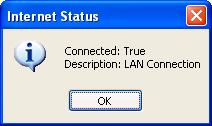

<div align="center">

## Internet Status


</div>

### Description

Determines if a connection to the internet has been established, also retrieves the type of connection. I recently submitted an article entry titled Internet Status. The methods in which I used to determine the same information was incorrectly used as I was miss-informed by ApiViewer 2002. I have resolved those problems.

PS. Don't ever depend on APIViewer for accurate Function declarations.
 
### More Info
 


<span>             |<span>
---                |---
**Submitted On**   |
**By**             |[Alex Smoljanovic\(aLeX^rS\)](https://github.com/Planet-Source-Code/PSCIndex/blob/master/ByAuthor/alex-smoljanovic-alex-rs.md)
**Level**          |Beginner
**User Rating**    |5.0 (25 globes from 5 users)
**Compatibility**  |VB 3\.0, VB 4\.0 \(16\-bit\), VB 4\.0 \(32\-bit\), VB 5\.0, VB 6\.0
**Category**       |[Internet/ HTML](https://github.com/Planet-Source-Code/PSCIndex/blob/master/ByCategory/internet-html__1-34.md)
**World**          |[Visual Basic](https://github.com/Planet-Source-Code/PSCIndex/blob/master/ByWorld/visual-basic.md)
**Archive File**   |[](https://github.com/Planet-Source-Code/alex-smoljanovic-alex-rs-internet-status__1-42577/archive/master.zip)


### Source Code

```
<pre>Private Declare Function InternetGetConnectedState Lib "wininet.dll" (ByRef lpdwFlags As Long, ByVal dwReserved As Long) As Integer
Private Const INTERNET_CONNECTION_PROXY = &H4
Private Const INTERNET_CONNECTION_CONFIGURED = &H40
Private Const INTERNET_CONNECTION_LAN = &H2
Private Const INTERNET_CONNECTION_MODEM = &H1
Private Const INTERNET_RAS_INSTALLED = &H10
Private Const INTERNET_CONNECTION_OFFLINE = &H20
Private Type tConnectionStatus
 Connected As Boolean
 ConnectionType As String
 RASInstalled As Boolean
End Type
'general declarations....
Private Function GetConnectionInfo(ConnectionStatus As tConnectionStatus) As Boolean
Dim pdFlags& 'Dimensionalize pdFlags as long data type
 If InternetGetConnectedState(pdFlags&, 0) Then
 'Call InternetGetConnectedState to initialize pdFlags with the current connection information flags
 GetConnectionInfo = True
 'InterNetGetConnectedState function was successful, return true
 If (pdFlags& And INTERNET_CONNECTION_PROXY) = INTERNET_CONNECTION_PROXY Then
'Perform a Bitwise And operation to determine if the variable pdFlags specifies the Internet_Connection_Proxy constant
 ConnectionStatus.ConnectionType = "Local system uses a proxy server to connect to the Internet."
'Initialize ConnectionStatus's ConnectionType member with the appropriate connection description
  ConnectionStatus.Connected = True
  'Initialize this structures Connected member
 End If
 If (pdFlags& And INTERNET_CONNECTION_CONFIGURED) = INTERNET_CONNECTION_CONFIGURED Then
  ConnectionStatus.Connected = True
  ConnectionStatus.ConnectionType = "Local system has a valid connection to the Internet, but it might or might not be currently connected."
 End If
  If (pdFlags& And INTERNET_CONNECTION_LAN) = INTERNET_CONNECTION_LAN Then
  ConnectionStatus.ConnectionType = "Local system uses a local area network to connect to the Internet."
  ConnectionStatus.Connected = True
  End If
  If (pdFlags& And INTERNET_CONNECTION_MODEM) = INTERNET_CONNECTION_MODEM Then
  ConnectionStatus.ConnectionType = "Local system uses a modem to connect to the Internet."
  ConnectionStatus.Connected = True
  End If
  If (pdFlags& And INTERNET_CONNECTION_OFFLINE) = INTERNET_CONNECTION_OFFLINE Then
  ConnectionStatus.ConnectionType = "Local system is in offline mode."
   ConnectionStatus.Connected = False
  End If
  If (pdFlags& And INTERNET_RAS_INSTALLED) = INTERNET_RAS_INSTALLED Then
   ConnectionStatus.RASInstalled = True
  End If
 End If
End Function
Private Sub Command1_Click()
Dim MyConnectionStatus As tConnectionStatus
'Dimensionalize MyConnectionStatus as user-defined type structure tConnectionStatus
 GetConnectionInfo MyConnectionStatus 'See this sub routine for more info...
 MsgBox "Connected: " & MyConnectionStatus.Connected & vbCrLf & "Type: " & MyConnectionStatus.ConnectionType
 'Show MsgBox modal dialog to display the connection info...
End Sub</pre>
```

